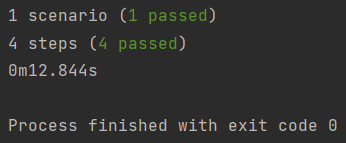

## To-Do Application Acceptence (E2E) Test

```gherkin
Feature: Todo List Project
  As User he/she wants to surf on our todo list project

  Scenario: User should add some tasks on tasks page
    Given Empty ToDo list
    When User write "buy some milk" to text box
    When and User click to add button
    Then User should see "buy some milk" text in ToDo list
```


### Run Test
```
yarn install
yarn start
```

### Tech

* **Puppeteer**
* **Cucumber**


<br>
Results of acceptence test



<br>


